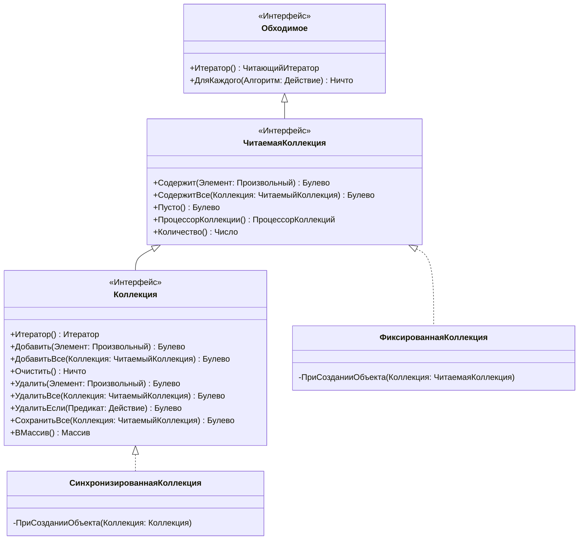
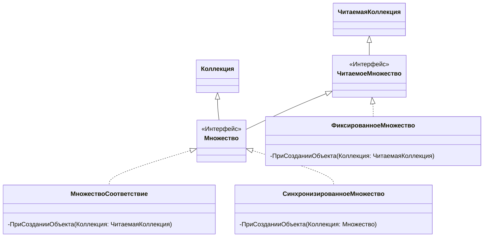
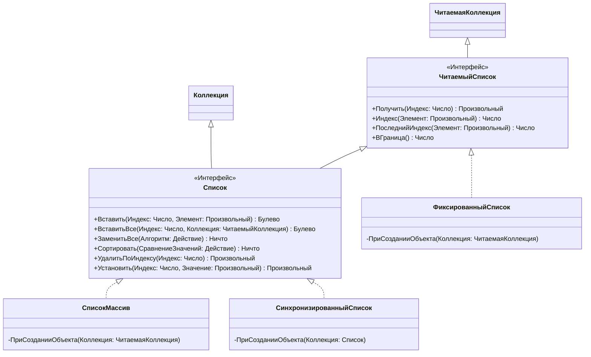
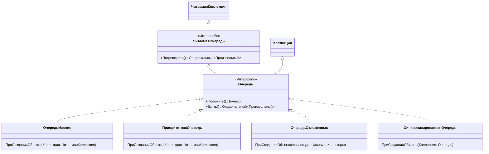
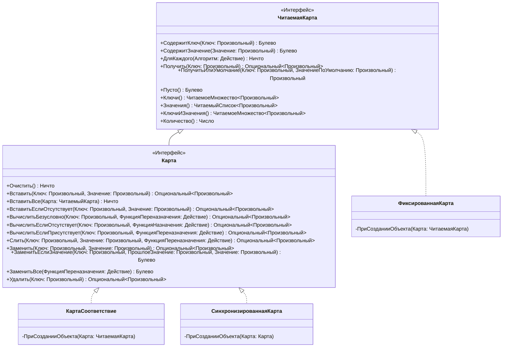
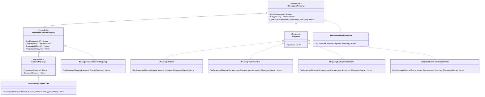

# CollectionOS

КоллекшонОС это фреймворк коллекций для OneScript

## Особенности
Начиная с версии OneScript 2.0 появилась возможность обходить собственные классы коллекции циклом `Для каждого`, особенность описанная ниже актуальна для более ранних версий движка:

Так как в OneScript нет возможности сделать класс обходимым, то все представленные коллекции нельзя обойти циклом `Для каждого`, вместо этого вы можете воспользоваться итератором:

```bsl
СписокМассив = Новый СписокМассив;
СписокМассив.Добавить(1);
СписокМассив.Добавить(2);
СписокМассив.Добавить(3);

Итератор = СписокМассив.Итератор();

Пока Итератор.ЕстьСледующий() Цикл

    Элемент = Итератор.Следующий();

    Сообщить(Элемент);

КонецЦикла;

// > 1
// > 2
// > 3
```

## Диаграмма классов:

### Обходимое
---



### Множество
---



### Список
---



### Очередь
---



### Карта
---



### Итератор
---


