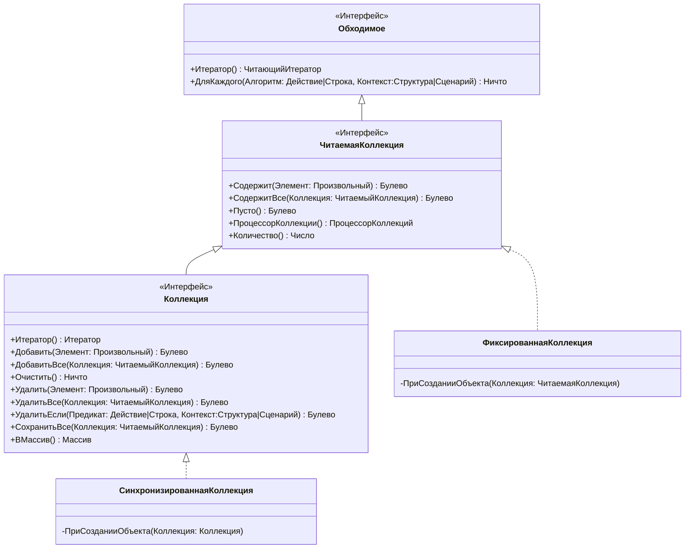
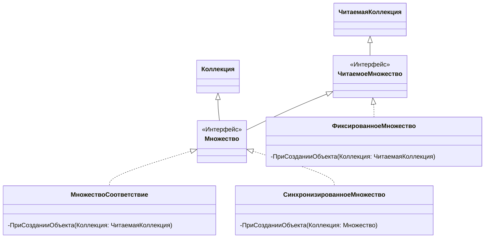
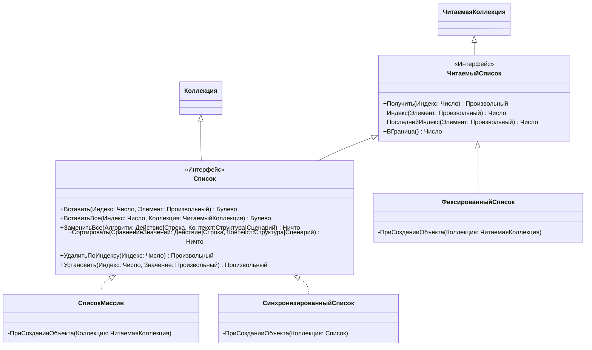
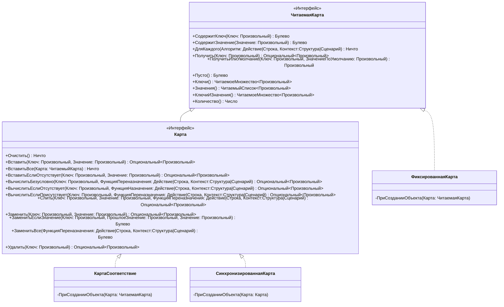
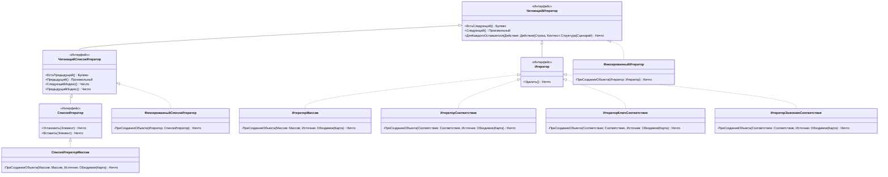

# CollectionOS

КоллекшонОС это фреймворк коллекций для OneScript

## Коллекции

Фреймворк предоставляет следующие коллекции

### Множества

Множества - неиндексированные коллекции уникальных элементов.

1. МножествоСоответствие - Множество, реализованное на базе соответствия.
1. МножествоКарта - Множество, реализованное на базе карты.

### Списки

Спики - индексированные коллекции элементов.

1. СписокМассив - Список, реализованный на базе массива.

### Карты

Карты - Коллекции пар ключ-значение.

1. КартаСоответствие - Карта, реализованная на базе соответствия.

### Очереди

Очереди - коллекции элементов, в которых элементы добавляются в конец и извлекаются из начала.

1. ОчередьМассив - Очередь, реализованная на базе массива.
1. ПриоритетнаяОчередь - Очередь, реализованная на базе массива, которая сортируются элементы в порядке заданным компаратором.
1. ОчередьОтложенных - Потокобезопасная очередь, частный случай приоритетной очереди, элементы которой должны иметь метод `Задержка` которые возвращает количество миллисекунд до того как элемент станет доступным для извлечения, элементы очереди сортируются в порядке возрастания задержек.

## Представления

Представления - специальные объекты "обёртки" для коллекций, в конструктор которой передаётся коллекция, и которая предоставляет дополнительные гарантии.

### Синхронизированные

Синхронизированные представления предоставляют потокобезопасные обёртки для коллекций.

1. СинхронизированнаяКоллекция - Представление реализующее интерфейс `Коллекция`.
1. СинхронизированноеМножество - Представление реализующее интерфейс `Множество`.
1. СинхронизированныйСписок - Представление реализующее интерфейс `Список`.
1. СинхронизированнаяКарта - Представление реализующее интерфейс `Карта`.
1. СинхронизированнаяОчередь - Представление реализующее интерфейс `Очередь`.

### Фиксированные

Фиксированные представления предоставляют неизменяемые обёртки для коллекций.

1. ФиксированнаяКоллекция - Представление реализующее интерфейс `ЧитаемаяКоллекция`.
1. ФиксированноеМножество - Представление реализующее интерфейс `ЧитаемоеМножество`.
1. ФиксированныйСписок - Представление реализующее интерфейс `ЧитаемыйСписок`.
1. ФиксированнаяКарта - Представление реализующее интерфейс `ЧитаемаяКарта`.

## Диаграмма классов

### Обходимое

---

### Множество

---

### Список

---

### Очередь

---

### Карта

---

### Итератор

---

