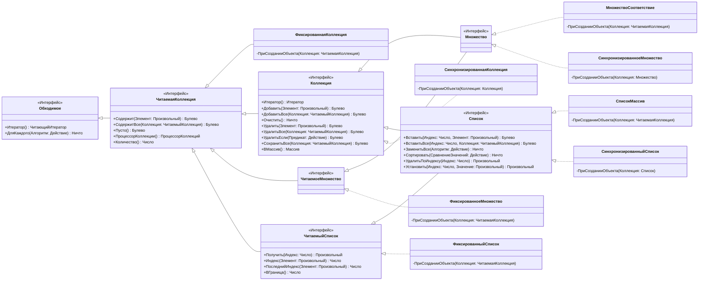
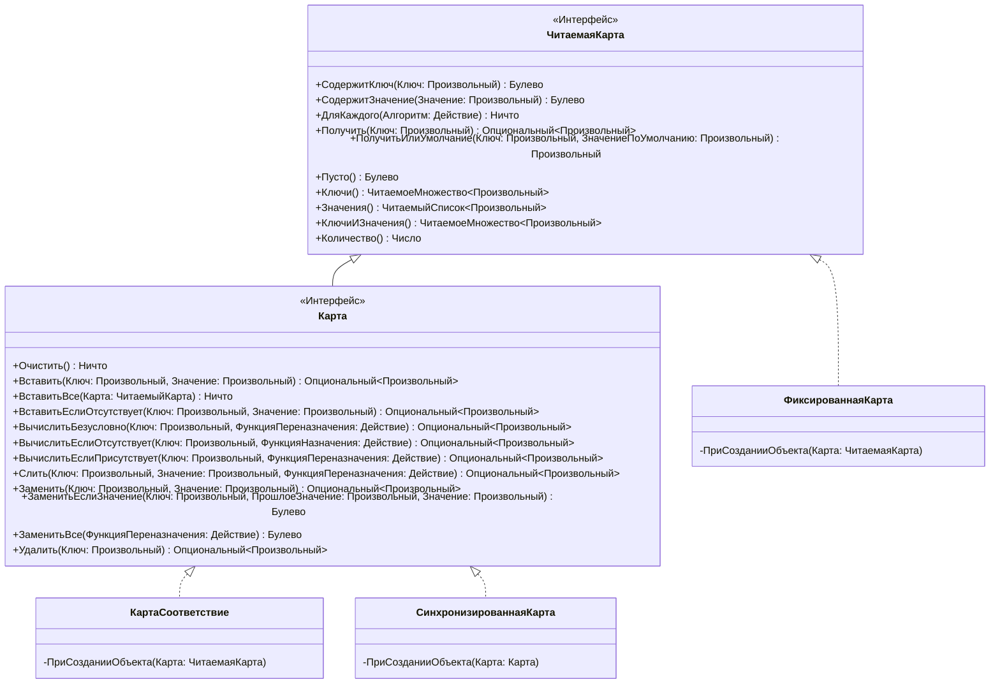
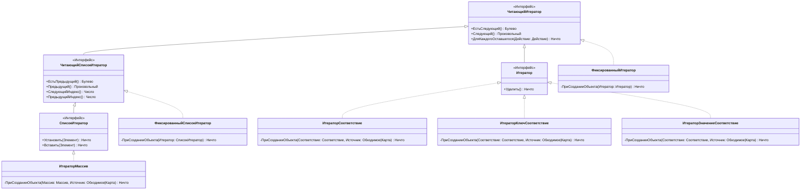

# CollectionOS

КоллекшонОС это фреймворк коллекций для OneScript

## Особенности
Так как в OneScript нет возможности сделать класс обходимым, то все представленные коллекции нельзя обойти циклом `Для каждого`, вместо этого вы можете воспользоваться итератором:

```bsl
СписокМассив = Новый СписокМассив;
СписокМассив.Добавить(1);
СписокМассив.Добавить(2);
СписокМассив.Добавить(3);

Итератор = СписокМассив.Итератор();

Пока Итератор.ЕстьСледующий() Цикл

    Элемент = Итератор.Следующий();

    Сообщить(Элемент);

КонецЦикла;

// > 1
// > 2
// > 3
```

## Диаграмма классов:

### Обходимое
---



### Карта
---



### Итератор
---



# Программный интерфейс

## ЧитающийИтератор

### ЕстьСледующий

```bsl
// Проверяет что есть следующий элемент коллекции
//
//  Возвращаемое значение:
//   Булево - Истина, если есть следующий элемент коллекции
//
Функция ЕстьСледующий() 
```

### Следующий

```bsl
// Возвращает следующий элемент коллекции
//
//  Возвращаемое значение:
//   Произвольный - следующий элемент коллекции
//
Функция Следующий() 
```

### ДляКаждогоОставшегося

```bsl
// Выполняет переданный алгоритм для каждого элемента коллекции
//  начиная с того на который указывает итератор
//
// Параметры:
//   Действие - Действие - Делегат на процедуру с одним параметром
//    которая принимает элемент коллекции
//            - Строка - Лямбда выражение с одним параметром
//    которая принимает элемент коллекции
//
// Пример:
//    Итератор.ДляКаждогоОставшегося(Элемент -> Сообщить(Элемент));
//
Процедура ДляКаждогоОставшегося(Действие) 
```

---

## Итератор

### Удалить

```bsl
// Удаляет элемент на который указывает итератор
//
Процедура Удалить() 
```
---
## ЧитающийСписокИтератор

### ЕстьПредыдущий

```bsl
// Проверяет что есть предыдущий элемент коллекции
//
//  Возвращаемое значение:
//   Булево - Истина, если есть предыдущий элемент коллекции
//
Функция ЕстьПредыдущий() 
```

### Предыдущий

```bsl
// Возвращает предыдущий элемент коллекции
//
//  Возвращаемое значение:
//   Произвольный - предыдущий элемент коллекции
//
Функция Предыдущий() 
```

### СледующийИндекс

```bsl
// Возвращает индекс на который указывает итератор
//
//  Возвращаемое значение:
//   Число - Индекс на который указывает итератор
//
Функция СледующийИндекс() 
```

### ПредыдущийИндекс

```bsl
// Возвращает предыдущий индекс от того на который указывает итератор
//
//  Возвращаемое значение:
//   Число - Предыдущий индекс от того на который указывает итератор
//
Функция ПредыдущийИндекс() 
```
---
## СписокИтератор

### Установить

```bsl
// Заменяет значение на которое указывает итератор
//
// Параметры:
//   Элемент - Произвольный - Устанавливаемый элемент
//
Процедура Установить(Элемент) 
```

### Вставить

```bsl
// Вставляет элемент по месту указания итератора
//
// Параметры:
//   Элемент - Произвольный - вставляемый элемент
//
Процедура Вставить(Элемент) 
```
---

## Обходимое

### Итератор

```bsl
// Возвращает итератор коллекции
//
//  Возвращаемое значение:
//   Итератор - Итератор коллекции
//
Функция Итератор() 
```

### ДляКаждого

```bsl
// Выполняет переданный алгоритм для каждого элемента коллекции
//
// Параметры:
//   Алгоритм - Действие - Делегат на процедуру с одним параметром, в который
//    будет передан элемент коллекции
//            - Строка - Лямбда выражение с одним параметром, в который будет
//    будет передан элемент коллекции
//
// Пример:
//    Обходимое.ДляКаждого("Элемент -> Сообщить(Элемент)");
//
Процедура ДляКаждого(Алгоритм) 
```
---

## ЧитаемаяКоллекция

### Содержит

```bsl
// Проверяет содержится ли указанный элемент в коллекции
//
// Параметры:
//   Элемент - Произвольный - Проверяемый элемент
//
//  Возвращаемое значение:
//   Булево - Истина, если коллекция содержит указанный элемент
//
Функция Содержит(Элемент) 
```

### СодержитВсе

```bsl
// Проверяет что коллекция содержит все элементы переданной коллекции
//
// Параметры:
//   Коллекция - ЧитаемыйКоллекция - Коллекция, элементы которой проверяются на вхождение
//
//  Возвращаемое значение:
//   Булево - Истина, если коллекция содержит все элементы переданной коллекции
//
Функция СодержитВсе(Коллекция) 
```

### Пусто

```bsl
// Проверяет что коллекция пустая
//
//  Возвращаемое значение:
//   Булево - Истина, если коллекция пуста
//
Функция Пусто() 
```

### ПроцессорКоллекции

```bsl
// Возвращает процессор коллекции по текущей коллекции
//
//  Возвращаемое значение:
//   ПроцессорКоллекций - Процессор коллекции
//
Функция ПроцессорКоллекции() 
```

### Количество

```bsl
// Возвращает количество элементов коллекции
//
//  Возвращаемое значение:
//   Число - Количество элементов коллекции
//
Функция Количество() 
```

### ВМассив

```bsl
// Выгружает элементы коллекции в массив
//
//  Возвращаемое значение:
//   Массив из Произвольный - массив элементов коллекции
//
Функция ВМассив() 
```
---

## Коллекция

### Добавить

```bsl
// Добавляет элемент в коллекцию
//
// Параметры:
//   Элемент - Произвольный - Добавляемый элемент
//
//  Возвращаемое значение:
//   Булево - Истина, если элемент добавлен
//
Функция Добавить(Элемент) 
```

### ДобавитьВсе

```bsl
// Добавляет все элементы из переданной коллекции
//
// Параметры:
//   Коллекция - ЧитаемыйКоллекция - Коллекция, элементы которой требуется добавить
//
//  Возвращаемое значение:
//   Булево - Истина, если был добавлен хотя бы один элемент
//
Функция ДобавитьВсе(Коллекция) 
```

### Очистить

```bsl
// Очищает коллекцию
//
Процедура Очистить() 
```

### Удалить

```bsl
// Удаляет переданный элемент из коллекции
//
// Параметры:
//   Элемент - Произвольный - Удаляемый элемент
//
//  Возвращаемое значение:
//   Булево - Истина, если элемент был удалён
//
Функция Удалить(Элемент) 
```

### УдалитьВсе

```bsl
// Удаляет все элементы которые содержаться в переданной коллекции
//
// Параметры:
//   Коллекция - ЧитаемыйКоллекция - Коллекция, элементы которой будут удалены
//
//  Возвращаемое значение:
//   Булево - Истина, если был удалён хотя бы один элемент
//
Функция УдалитьВсе(Коллекция) 
```

### УдалитьЕсли

```bsl
// Удаляет элементы для которых функция предикат вернёт Истина
//
// Параметры:
//   Предикат - Действие - Делегат на функцию с одним параметром, в которой передаётся элемент коллекции
//            - Строка - Лямбда выражение с одним параметром, в который передаётся элемент коллекции
//
// Пример:
//    Коллекция.УдалитьЕсли("(Элемент) -> Элемент >= 2");
//
//  Возвращаемое значение:
//   Булево - Истина, если был удалён хотя бы один элемент
//
Функция УдалитьЕсли(Предикат) 
```

### СохранитьВсе

```bsl
// Удаляет все элементы которые не содержаться в переданной коллекции
//
// Параметры:
//   Коллекция - ЧитаемыйКоллекция - Коллекция, элементы которой будут сохранены
//
//  Возвращаемое значение:
//   Булево - Истина, если был удалён хотя бы один элемент
//
Функция СохранитьВсе(Коллекция) 
```
---

## ЧитаемыйСписок

### Получить

```bsl
// Получает элемент коллекции по индексу
//
// Параметры:
//   Индекс - Число - Индекс, по которому требуется получить элемент списка
//
//  Возвращаемое значение:
//   Произвольный - элемент списка по переданному индексу
//
Функция Получить(Индекс) 
```

### Индекс

```bsl
// Возвращает индекс первого вхождения переданного элемента
//
// Параметры:
//   Элемент - Произвольный - Элемент, индекс которого требуется получить
//
//  Возвращаемое значение:
//   Число - Индекс элемента коллекции, или -1 если коллекция не содержит элемент
//
Функция Индекс(Элемент) 
```

### ПоследнийИндекс

```bsl
// Возвращает индекс последнего вхождения переданного элемента
//
// Параметры:
//   Элемент - Произвольный - Элемент, индекс которого требуется получить
//
//  Возвращаемое значение:
//   Число - Индекс элемента коллекции, или -1 если коллекция не содержит элемент
//
Функция ПоследнийИндекс(Элемент) 
```

### ВГраница

```bsl
// Возвращает максимальный индекс списка
//
//  Возвращаемое значение:
//   Число - максимальный индекс списка
//
Функция ВГраница() 
```

## Список

### Вставить

```bsl
// Вставляет элемент в список по индексу
//
// Параметры:
//   Индекс - Число - Индекс, по которому будет вставлен элемент
//   Элемент - Произвольный - Вставляемый элемент
//
//  Возвращаемое значение:
//   Булево - Истина, если элемент вставлен
//
Функция Вставить(Индекс, Элемент) 
```

### ВставитьВсе

```bsl
// Вставляет все элементы из коллекции начиная с индекса
//
// Параметры:
//   Индекс - Число - Индекс, начиная с которого будет вставлены элементы 
//   Коллекция - ЧитаемыйКоллекция - Коллекция, из которой будут вставлены элементы
//
//  Возвращаемое значение:
//   Булево - Истина, если был вставлен хотя бы один элемент
//
Функция ВставитьВсе(Индекс, Коллекция) 
```

### ЗаменитьВсе

```bsl
// Заменяет все элементы в списке через алгоритм
//
// Параметры:
//   Алгоритм - Действие - Делегат на функцию с одним параметром, в которую передаётся
//    элемент списка, и которая возвращает новое значение элемента
//            - Строка - Лямбда выражение с одним параметром, в который передаётся
//    элемент списка, и которая возвращает новое значение элемента
//
// Пример:
//    Список.ЗаменитьВсе("Элемент -> Элемент + 1");
//
Процедура ЗаменитьВсе(Алгоритм) 
```

### Сортировать

```bsl
// Сортирует список в соответствии с переданным алгоритмом
//
// Параметры:
//   СравнениеЗначений - Действие - Делегат на функцию с двумя параметрами
//    в которую передаются 2 элемента коллекции, и которая возвращает число
//      1 - Если первый элемент больше,
//     -1 - Если второй элемент больше,
//      0 - Если элементы равны
//                     - Строка - Лямбда выражение с двумя параметрами
//    в которую передаются 2 элемента коллекции, и которая возвращает число
//      1 - Если первый элемент больше,
//     -1 - Если второй элемент больше,
//      0 - Если элементы равны
//
// Пример:
//    Список.Сортировать("Первый, Второй -> {
//        | Если Первый > Второй Тогда
//        |     Возврат 1;
//        | ИначеЕсли Второй > Первый Тогда
//        |     Возврат -1;
//        | Иначе
//        |     Возврат 0;
//        | КонецЕсли;
//        |}"
//    );
//
```

### УдалитьПоИндексу

```bsl
// Удаляет элемент списка по индексу
//
// Параметры:
//   Индекс - Число - Индекс удаляемого элемента
//
//  Возвращаемое значение:
//   Произвольный - Значение которое было удалено
//
Функция УдалитьПоИндексу(Индекс) 
```

### Установить

```bsl
// Устанавливает значение по индексу
//
// Параметры:
//   Индекс - Число - Индекс устанавливаемого элемента
//   Значение -Произвольный - Устанавливаемый элемент
//
//  Возвращаемое значение:
//   Произвольный - Значение которое было заменено
//
Функция Установить(Индекс, Значение) 
```
---

## ЧитаемаяКарта

### СодержитКлюч

```bsl
// Проверяет что карта содержит переданный ключ
//
// Параметры:
//   Ключ - Произвольный - Проверяемый ключ
//
//  Возвращаемое значение:
//   Булево - Истина, если карта содержит указанный ключ
//
Функция СодержитКлюч(Ключ) 
```

### СодержитЗначение

```bsl
// Проверяет что карта содержит указанное значение
//
// Параметры:
//   Значение - Произвольный - Проверяемое значение
//
//  Возвращаемое значение:
//   Булево - Истина, если карта содержит указанное значение
//
Функция СодержитЗначение(Значение) 
```

### ДляКаждого

```bsl
// Выполняет переданное действие для каждого элемента карты
//
// Параметры:
//   Алгоритм - Действие - Делегат на метод с двумя параметрами который будет выполнятся
//    в первый параметр передаётся ключ во второй значение
//            - Строка - Лямбда выражение с двумя параметрами в первый параметр передаётся ключ во второй значение
//
// Пример:
//     Карта.ДляКаждого("(Ключ, Значение) -> Сообщить(СтрШаблон(""Ключ: %1, Значение:2"", Ключ, Значение))");
//
Процедура ДляКаждого(Алгоритм) 
```

### Получить

```bsl
// Возвращает значение по ключу карты
//
// Параметры:
//   Ключ - Произвольный - Ключ, по которому требуется получить значение
//
//  Возвращаемое значение:
//   Опциональный<Произвольный> - Опциональный, в котором содержится полученное значение или
//    пустой опциональный, если карта не содержит указанного ключа
//
Функция Получить(Ключ) 
```

### ПолучитьИлиУмолчание

```bsl
// Возвращает значение по ключу карты, или ЗначениеПоУмолчанию если карта не содержит ключ
//
// Параметры:
//   Ключ - Произвольный - Ключ, по которому требуется получить значение
//   ЗначениеПоУмолчанию - Произвольный - Значение, которое будет возвращено если карта не содержит ключ
//
//  Возвращаемое значение:
//   Произвольный<Произвольный> - Значение полученное по ключу карты, или ЗначениеПоУмолчанию если карта не содержит ключ
//
Функция ПолучитьИлиУмолчание(Ключ, ЗначениеПоУмолчанию) 
```

### Пусто

```bsl
// Возвращает признак того что карта не содержит пар КлючИЗначение
//
//  Возвращаемое значение:
//   Булево - Истина, если карта не содержит пар КлючИЗначение
//
Функция Пусто() 
```

### Ключи

```bsl
// Возвращает множество ключей содержащихся в карте
//
//  Возвращаемое значение:
//   ЧитаемоеМножество - Множество ключей содержащихся в карте
//
Функция Ключи() 
```

### Значения

```bsl
// Возвращает коллекцию значений содержащихся в карте
//
//  Возвращаемое значение:
//   ЧитаемаяКоллекция - Коллекция значений содержащихся в карте
//
Функция Значения() 
```

### КлючиИЗначения

```bsl
// Возвращает множество пар КлючИЗначение содержащихся в карте
//
//  Возвращаемое значение:
//   ЧитаемоеМножество - Множество пар КлючИЗначение содержащихся в карте
//
Функция КлючиИЗначения() 
```

### Количество

```bsl
// Возвращает количество пар КлючИЗначение содержащихся в карте
//
//  Возвращаемое значение:
//   Число - Количество пар КлючИЗначение содержащихся в карте
//
Функция Количество() 
```
---

## Карта

### Очистить

```bsl
// Удаляет все элементы карты
//
Процедура Очистить() 
```

### Вставить

```bsl
// Вставляет в карту переданную пару ключ и значение
//
// Параметры:
//   Ключ - Произвольный - Вставляемый ключ
//   Значение - Произвольный - Вставляемое значение
//
//  Возвращаемое значение:
//   Опциональный<Произвольный> - Значение, ранее было связанное с ключом
//
Функция Вставить(Ключ, Значение) 
```

### ВставитьВсе

```bsl
// Вставляет все значения из переданной карты
//
// Параметры:
//   Карта - Карта - Карта, значения из которой вставляются
//
Процедура ВставитьВсе(Карта) 
```

### ВставитьЕслиОтсутствует

```bsl
// Вставляет в карту переданную пару ключ и значение, если карта не содержит переданного ключа 
//
// Параметры:
//   Ключ - Произвольный - Вставляемый ключ
//   Значение - Произвольный - Вставляемое значение
//
//  Возвращаемое значение:
//   Опциональный<Произвольный> - Значение, связанное с ключом, пустой если карта не содержала ключа
//
Функция ВставитьЕслиОтсутствует(Ключ, Значение) 
```

### ВычислитьБезусловно

```bsl
// Вычисляет значение для переданного ключа через функцию переназначения, если функция вернёт значение
//  то оно будет вставлено по указанному ключу, если функция вернёт Неопределено, то из карты будет удалён
//  переданный ключ, если ранее карта его содержала
//
// Параметры:
//   Ключ - Произвольный - Ключ, для которого вычисляется значение
//   ФункцияПереназначения - Действие - Делегат на функцию с двумя параметрами, в которую передаются ключ
//    и Опциональный от текущего значения ключа (пустой если ключа нет)
//                         - Строка - Лямбда выражение с двумя параметрами в которую будут переданы ключ
//    и Опциональный от текущего значения ключа (пустой если ключа нет)
//
// Пример:
//    Карта.ВычислитьБезусловно("Ключ", "(Ключ, Значение) -> ?(Значение.Пустой(), Истина, Ложь)")
//
//  Возвращаемое значение:
//   Опциональный<Произвольный> - Новое значение ключа
//
Функция ВычислитьБезусловно(Ключ, ФункцияПереназначения) 
```

### ВычислитьЕслиОтсутствует

```bsl
// Вычисляет значение для переданного ключа, если текущая карта не содержит переданного ключа,
//  через функцию назначения, функция будет вызвана только если карта не содержит ключа,
//  если функция вернёт значение, оно будет вставлено в карту по указанному ключу,
//  если функция вернёт Неопределенно, то значение вставлено не будет
//
// Параметры:
//   Ключ - Произвольный - Ключ, для которого вычисляется значение
//   ФункцияНазначения - Действие - Делегат на функцию с одним параметром, в которую передаётся переданный ключ
//                     - Строка - Лямбда выражение с одним параметром в который будет передан переданный ключ
//
// Пример:
//    Карта.ВычислитьЕслиОтсутствует("Ключ", "(Ключ) -> СтрДлина(Ключ)")
//
//  Возвращаемое значение:
//   Опциональный<Произвольный> - Новое значение ключа если оно было вычислено, или текущее значение ключа
//    если карта уже содержала переданный ключ
//
Функция ВычислитьЕслиОтсутствует(Ключ, ФункцияНазначения) 
```

### ВычислитьЕслиПрисутствует

```bsl
// Вычисляет значение для переданного ключа, если текущая карта содержит переданный ключ,
//  через функцию переназначения, функция будет вызвана только если карта содержит ключ,
//  если функция вернёт значение, оно будет вставлено в карту по указанному ключу,
//  если функция вернёт Неопределенно, то ключ будет удалён из карты
//
// Параметры:
//   Ключ - Произвольный - Ключ, для которого вычисляется значение
//   ФункцияПереназначения - Действие - Делегат на функцию с двумя параметрами, в которую передаются ключ
//    и текущее значение ключа
//                         - Строка - Лямбда выражение с двумя параметрами, в которые передаются ключ и текущее
//    значение ключа
//
// Пример:
//    Карта.ВычислитьЕслиПрисутствует("Ключ", "(Ключ, Значение) -> {
//        |   Если Ключ = ""Ключ"" Тогда
//        |       Возврат СтрДлина(Значение.Получить());
//        |   Иначе
//        |       Возврат Неопределенно;
//        |   КонецЕсли;
//        |}"
//    );
//
//  Возвращаемое значение:
//   Опциональный<Произвольный> - Новое значение ключа
//
Функция ВычислитьЕслиПрисутствует(Ключ, ФункцияПереназначения) 
```

### Слить

```bsl
// Объединяет текущее и переданное значение по указанному ключу через функцию переназначения,
//  функция будет вызвана только если существует текущее значение ключа, в ином случае будет вставлено значение
//  если функция вернёт значение, оно будет вставлено в карту по указанному ключу,
//  если функция вернёт Неопределенно, то ключ будет удалён из карты
//
// Параметры:
//   Ключ - Произвольный - Ключ, значения для которого требуется объединить
//   Значение - Произвольный - Новое значение ключа
//   ФункцияПереназначения - Действие - Делегат на функцию с двумя параметрами в которые передаются
//    существующее и новое значение ключа
//                         - Строка - Лямбда выражение с двумя параметрами в которые передаются 
//    существующее и новое значение ключа
//
// Пример:
//    Карта.Слить("Ключ", 4, "(СуществующееЗначение, НовоеЗначение) -> 
//        | Возврат ?(НовоеЗначение > СуществующееЗначение,
//        |     НовоеЗначение,
//        |     СуществующееЗначение
//        | );")
//
//  Возвращаемое значение:
//   Опциональный<Произвольный> - Новое значение ключа
//
Функция Слить(Ключ, Значение, ФункцияПереназначения) 
```

### Заменить

```bsl
// Заменяет значение по переданному ключу, если ключа в карте нет, то замена не происходит
//
// Параметры:
//   Ключ - Произвольный - Ключ, значение которого требуется заменить
//   Значение - Произвольный - Новое значение ключа
//
//  Возвращаемое значение:
//   Опциональный<Произвольный> - Прошлое значение ключа, или пустой, если ключа не было
//
Функция Заменить(Ключ, Значение) 
```

### ЗаменитьЕслиЗначение

```bsl
// Заменяет значение по переданному ключу с проверкой текущего значения,
//  если ключа в карте нет, то замена не происходит
//
// Параметры:
//   Ключ - Произвольный - Ключ, значение которого требуется заменить
//   ПрошлоеЗначение - Произвольный - Значение, которое должно быть связано с ключом для замены
//   Значение - Произвольный - Новое значение ключа
//
//  Возвращаемое значение:
//   Булево - Истина, если замена была произведена
//
Функция ЗаменитьЕслиЗначение(Ключ, ПрошлоеЗначение, Значение) 
```

### ЗаменитьВсе

```bsl
// Заменяет значение для всех ключей карты, через функцию переназначения
//
// Параметры:
//   ФункцияПереназначения - Действие - Делегат на функцию с двумя параметрами, в которую
//    передаются ключ и значение ключа
//                         - Строка - Лямбда выражение с двумя параметрами, в которые передаются
//    ключ и значение ключа
//
// Пример:
//    Карта.ЗаменитьВсе("(Ключ, Значение) -> Значение + 1")
//
Процедура ЗаменитьВсе(ФункцияПереназначения) 
```

### Удалить

```bsl
// Удаляет переданный ключ из карты
//
// Параметры:
//   Ключ - Произвольный - Удаляемый ключ
//
//  Возвращаемое значение:
//   Опциональный<Произвольный> - Значение, ранее было связанное с ключом
//
Функция Удалить(Ключ) 
```
